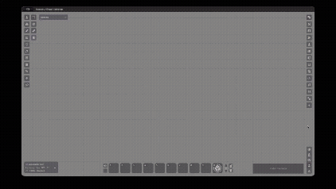

# Sidebar and Windows Resizer

A FoundryVTT v13/v14 module that lets each user resize parts of the interface:

- **Sidebar width** — drag the inner edge of the right-hand sidebar.
- **Chat input height** — drag the top edge of the chat input; the log above shares the space.
- **Pop-out windows** — popped-out sidebar windows (Combat Tracker, Playlists, directories, Compendium) become resizable.

Sizes are remembered per device. Each resizer can be toggled independently in the module settings.



## Have an idea or a feedback ?

If there's a workflow that annoys you, a small thing that could be smoother, or a feature you keep wishing existed — feel free to open a [GitHub issue](https://github.com/martin-papy/sidebar-resizer/issues) and describe it. A short note is plenty.

<a href='https://ko-fi.com/E7O820GI4E' target='_blank' align="center"></a>

## Installation

In Foundry's **Add-on Modules** tab → **Install Module** → paste this manifest URL:

```
https://github.com/martin-papy/sidebar-resizer/releases/latest/download/module.json
```

## Compatibility

- Minimum: FoundryVTT v13
- Verified: FoundryVTT v14
- System Agnostic

## Credits

A v13+ re-implementation inspired by the v12-only
[foundryvtt-sidebar-resizer](https://github.com/saif-ellafi/foundryvtt-sidebar-resizer)
by JeansenVaars, originally created by VanceCole.

## License

[MIT](./LICENSE)
